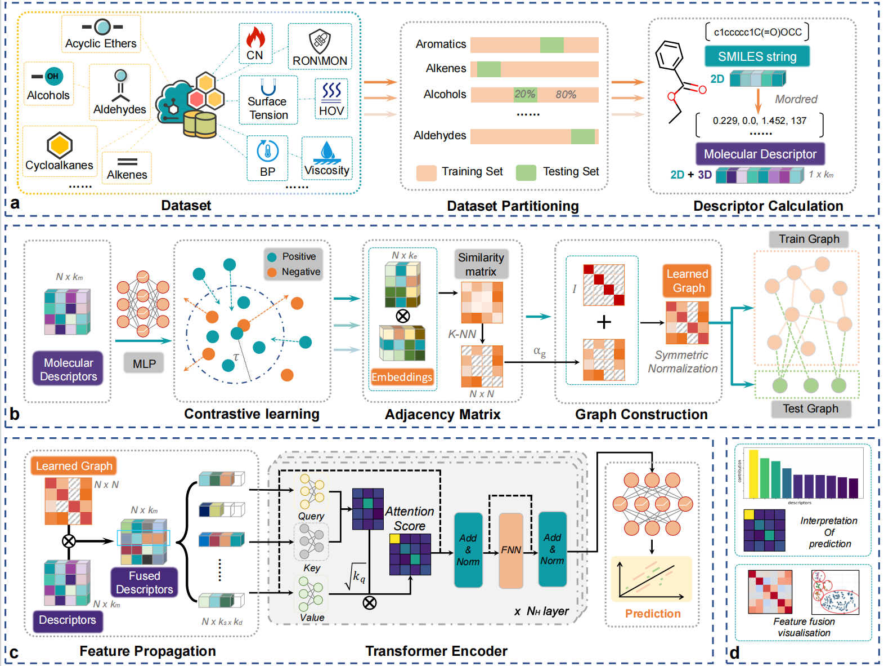

# LG-Transformer
[](https://example.com)  [](https://example.com)  [](https://example.com)


## Project Overview
Green fuels are essential for decarbonizing transportation sectors,  requiring accurate prediction of multiple physicochemical properties to optimize engine performance and emissions. Although artificial intelligence-based models demonstrate significant potential to accelerate fuel design, most existing methods cannot utilize the internal and external information within and between fuel molecules with interpretability, limiting their generalizability and multi-objective capabilities. To address these challenges, a novel deep learning framework, the learned graph feature fusion transformer (LG-Transformer), is proposed. This unified framework integrates contrastive learning-based graph construction with graph convolutional networks (GCNs) and Transformer encoders to simultaneously predict multiple key physicochemical properties critical for green fuel design. Supporting this effort, a comprehensive fuel property database is developed, containing 1850 diverse molecules across 26 chemical classes, each annotated with 17 key physicochemical properties relevant to engine performance. LG-Transformer achieves state-of-the-art performance with an average $R^2$ of 0.933, significantly outperforming conventional quantitative structure–property relationship models and deep learning baselines. Additionally, interpretability analyses via integrated gradients reveal underlying molecular structure–property relationships. Overall, this work establishes a powerful, generalizable, and interpretable framework that significantly accelerates virtual screening and rational design of advanced low-carbon fuels, bridging fundamental understanding and practical application to advance the discovery and optimization of next-generation sustainable fuels.



## Installation


### 1. Cloning the Project

First, you need to clone the project repository from GitHub to your local machine. You can do this by running the following command in your terminal:

```bash
git clone https://github.com/furyIndex/AI4fuel.git
```

This command will create a copy of the   project in your current working directory.

### 2. Setting Up the Environment

After cloning the project, the next step is to set up the project environment. This project uses Conda, a popular package and environment management system. To create the environment with all the required dependencies, navigate to the project directory and run:

```bash
cd AI4fuel
conda env create -f environment.yml
```

This command will read the environment.yml file and create a new Conda environment with the name specified in the file. It will also install all the dependencies listed in the file.
For installing the algos, you should use
```bash
python setup.py build_ext --inplace
``` 


### 3. Activating the Environment

Once the environment is created, you need to activate it. To do so, use the following command:

```bash
conda activate ai4fuel
```

Replace **ai4fuel** with the actual name of the environment, as specified in the **environment.yml** file.


## Training

Before training, you need to copy the dataset corresponding to this project to the ``./data`` directory. [Here](https://drive.google.com/file/d/11w5gG3wpER595AhroFRgGlBFD78njCzc/view?usp=drive_link) contains all databases used in this project.

### 1. Embedding Training

Usage:
```bash
usage: embedding_train.py [-h] [--num_epochs NUM_EPOCHS] [--margin MARGIN] [--batch_size BATCH_SIZE] [--hidden_dim HIDDEN_DIM] [--output_dim OUTPUT_DIM] [--lr LR] [--device DEVICE]

parameters for training molecular embedding

options:
  -h, --help              show this help message and exit
  --num_epochs NUM_EPOCHS number of training epochs (default: 50)
  --margin MARGIN         margin for contrastive loss (default: 3.0)
  --batch_size BATCH_SIZE batch size for training (default: 64)
  --hidden_dim HIDDEN_DIM hidden layer dimension in embedding network (default: 512)
  --output_dim OUTPUT_DIM output dimension of embedding network (default: 128)
  --lr LR                 learning rate for optimizer (default: 0.01)
  --device DEVICE         device to use for training, e.g. "cuda:0" or "cpu" (default: "cuda:0")
```
Commands for embedding training:
```bash
python learned_graph/embedding_train.py --num_epochs 50 \
--margin 3.0 \
--batch_size 64 \
--hidden_dim 512 \
--output_dim 128 \
--lr 0.01 \
--device cuda:0
```

### 2. Learned-graph feature fusion

```bash
python descriptors_group/save_learned_gcn_data.py
```
The default value for k in the code is 10, and the default value for $\alpha_g$ is 0.1. If you need to change other parameters, please set them manually.

### 3. Transformer training

Usage:
```bash
usage: learned_graph_train.py [-h] [--sheet_name SHEET_NAME] [--n_trials N_TRIALS] [--device DEVICE]

parameters for Optuna-based hyperparameter search for Transformer model

options:
  -h, --help              show this help message and exit
  --sheet_name SHEET_NAME fused data sheet name (default: 'lg_k=10_a=0.1')
  --n_trials N_TRIALS     number of Optuna trials for hyperparameter search (default: 100)
  --device DEVICE         device to use for training, e.g. "cuda:0" or "cpu" (default: "cuda:0")

```
Commands for embedding training:
```bash
python train_servier/learned_graph_train.py --sheet_name lg_k=10_a=0.1 \
--n_trials 100 \
--device cuda:0

```


## Training details

The optimal parameters for all fuel property prediction models are given in the ``save_models_server/parameter`` folder.


## Demo

The trained models corresponding to the versions in our paper are provided in ``save_models_server\lg_transformer``. Below is a demo for validating these models.

```bash
python load_model/gcn-transformer_review.py
```

The expected output is as follows:

```
=============================================
CN
train R2: 0.9641172289848328
test R2: 0.8978157639503479
=============================================
...
```


## License

This project is licensed under the MIT License - see the [LICENSE](LICENSE) file for details.